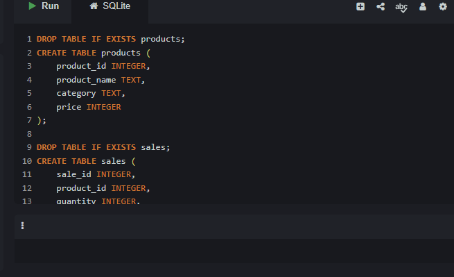
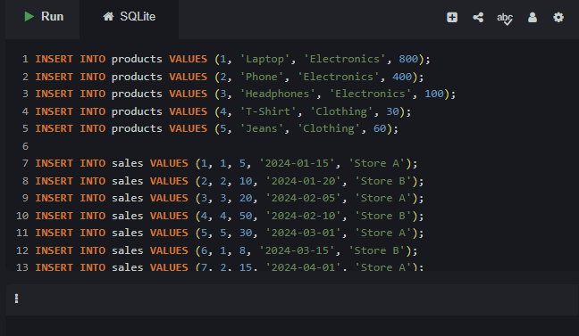
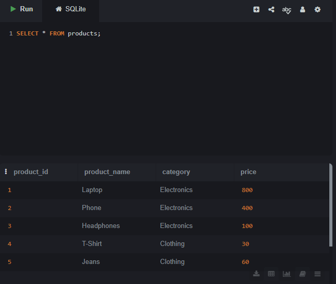
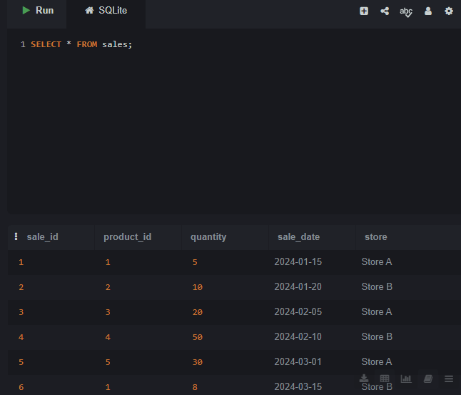
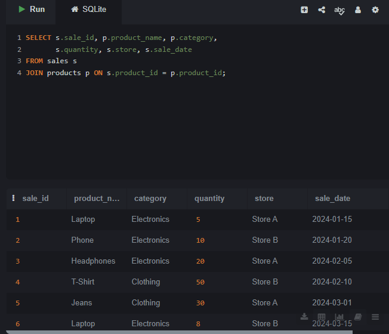
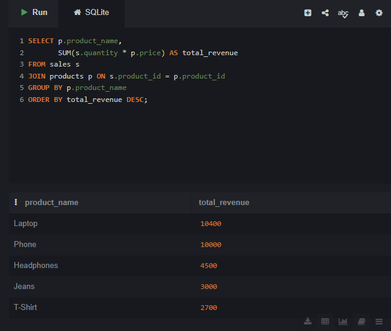
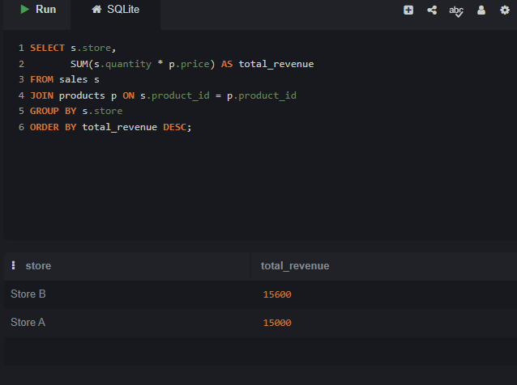
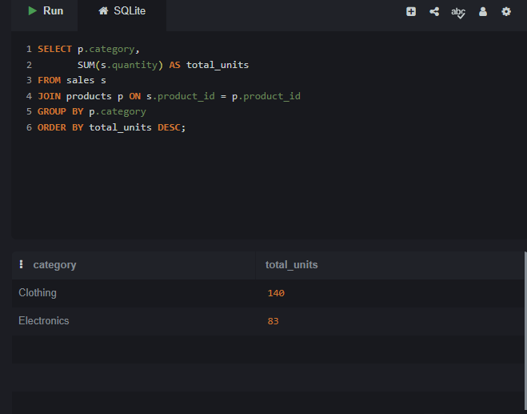

# Store Sales Analysis

## Problem
The company needs to understand which products and stores
generate the most revenue, and identify the best selling categories.

## Dataset
- 2 tables: Products and Sales
- 5 products across 2 categories
- 10 sales records across 2 stores
- Period: January 2024 - May 2024

## Tool Used
- SQL (SQLite)

## Key Findings
- Laptop generates the highest revenue ($10,400)
- Clothing is the best selling category by units (140 units)
- Electronics generates the highest revenue ($24,900)
- Store B has slightly higher revenue ($15,600) than Store A ($15,000)

## Decision & Recommendations
- Focus on Electronics as it drives most revenue
- Clothing sells more units but at lower prices
- Both stores perform similarly so expand both equally

## Analysis Steps & Results

### Step 1 & 2: Create Tables

### Step 3 & 4: Insert Data

### Step 5: All Products

### Step 6: All Sales

### Step 7: JOIN - Sales with Product Details

### Step 8: Total Revenue by Product

### Step 9: Total Revenue by Store

### Step 10: Best Selling Category

## Files
- store_sales_analysis.sql : All SQL queries
